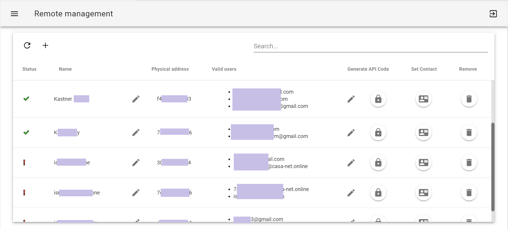

# remote-dashboard

set `VUE_APP_API_URL` environment variable to the remote server URL before building. 

otherways the default is `http://127.0.0.1:3001`.

## Screenshot


## Project setup
```
npm install
```

### Compiles and hot-reloads for development
```
npm run serve
```

### Compiles and minifies for production
```
npm run build
```

### Run your tests
```
npm run test
```

### Lints and fixes files
```
npm run lint
```

### Customize configuration
See [Configuration Reference](https://cli.vuejs.org/config/).
